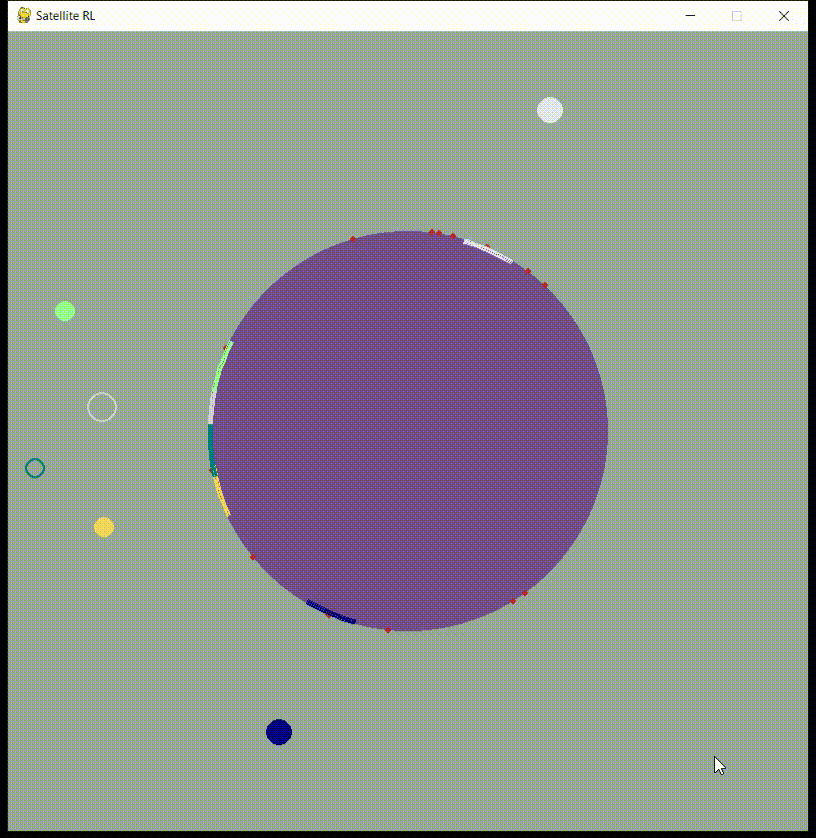

# Handover Operation with Reinforcement Learning
## Table of Contents
- [Introduction](#introduction)
- [Requirements](#requirements)
- [Installation](#installation)
- [Usage](#usage)
- [Training](#training)
- [Testing](#testing)
- [Results](#results)

## Introduction
This project implements a Handover or Handoff (HO) operation using reinforcement learning (RL) techniques. It focuses on training an agent to perform HO operations effectively in a simulated environment that is satellite communication environment. This project includes two parts designed to perform Handover: <u>*inter-satellite* HO</u> (Satellite HO) and <u>*intra-satellite* HO</u> (Spotbeam HO). The reinforcement learning algorithm employed here enables the agent to learn and adapt its actions to achieve optimal performance.

## Requirements
List the software and libraries required to run your project :
- Python 3.x
- OpenAI Gym
- stable-baselines3
- pygame
- tensorboard

You can also include any hardware requirements if necessary.

## Installation
1. Clone the repository to your local machine:

   ```bash
   git clone https://github.com/RezaEs79/Bachelor-Project.git

2. To install dependencies (It works on both **Linux** and **Windows**) :
   ```bash
    pip install  gym
    conda install stable-baselines3
    conda install multipledispatch
    conda install pygame
    pip install Shimmy
    conda install -c conda-forge tensorboard

3. Also, for any possible errors, these may be useful:
   ```bash
    pip install stable-baselines3[extra]
    pip install tensorflow --upgrade --force-reinstall
    pip install stable-baselines3[extra] --upgrade --force-reinstall
    pip3 install torch torchvision torchaudio
## Usage
To use this project, follow these steps:

- Chose your handover scenario in satellite communication: **Proj1** is inter satellite HO and **Proj2** is intra satellite HO. You can try following command to test whether it works or not:
    ```bash
    # in Proj1
    python Test.py
    ```
    or :
    ```bash
    # in Proj2
    python mytest.py
    ```
- Train the RL Agent: Train the reinforcement learning agent to optimize handover operations.

- Test the Agent: Evaluate the agent's performance and visualize the results.

<div style="display: flex; justify-content: space-between;">
  <div style="text-align: center;">
    
    <p>Simulation of inter Satellite HO</p>
  </div>
  <div style="text-align: center;">
    
    <p>Simulation of intra Satellite HO</p>
  </div>
</div>


## Train
To train the reinforcement learning agent, run the following command:
   ```bash
   python Model_builder.py
   ```
and then type **ppo** or **a2c** or **dqn** for your specific algorithm.
## Testing
To test the trained agent and evaluate its performance, use the following command:
   ```bash
   python Model_runner.py
   ```
and then type **ppo** or **a2c** or **dqn** for your specific algorithm.
## Results
For watching results obtained from your project, such as performance metrics, graphs, and visualizations. use codes in **MATLAB_Codes** folder and results that writed in .txt file.